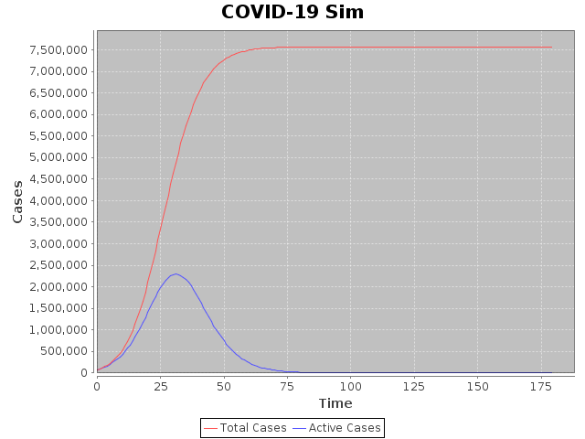
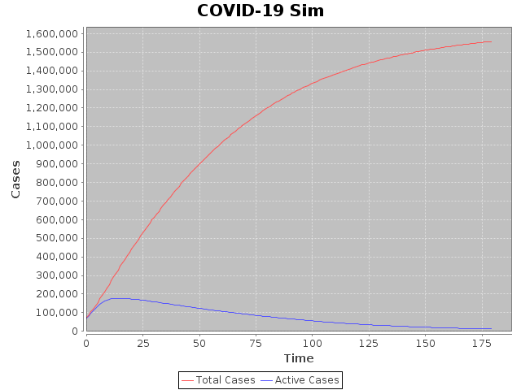
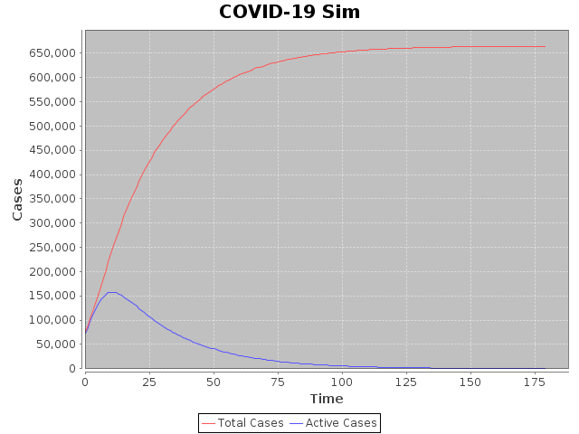

# Covid-19 Simulation
#### Simulate the future growth of Covid-19

## Simulation Model Design
This simulation is an agent (potential carriers of the disease) based SIR simulation, agents can transition from states
for states 'Susceptible' -> 'Infected' -> 'Removed'. There are a couple of assumptions made immediately with this type
of model:

1. Agents are contagious before exhibiting symptoms. This can be altered by splitting the infected state into 'Exposed' 
and 'Infected'states - it is likely COVID-19 is best represented as a SEIR where the transition out of S goes to E 
with some probability, directly to I otherwise.

2. Agents develop lifelong immunity once Recovered. Again, this is subject to change (dependent on future research) 
by allowing transitions back to S.

The initial growth rate is an approximation of the raw (pre-isolation or pre-quarantine) observed
daily growth rate, this is the rate at which an infected agent attempts to infect another randomly selected agent. In
order to accurately emulate a single agent's exposure to the population 'tiered communities' have been built into the
model. 

A 'tiered community' is a subset of the general population of a certain size with varying likelihoods of exposure
to different agents. The model currently has two tiers: isolation group (default: 4) and community (default: 1000), and 
infected agent will infect/expose an agent strictly in their isolation group with a probability of 95% otherwise they
will attempt to expose a randomly selected agent from the community.
- isolation groups are subsets of communities 
- no two communities are or isolation groups are identical

## Parameters

1. G0 base growth rate such that Casest+n = Casest G0n
2. Isolation Group Size
3. Community Size
4. Probability an infected agent containing their infection within the isolation group 
- The following as observed from a Weibull distribution
5. Incubation Duration mean (default 5.8 days)
6. Incubation Duration standard deviation (default 2.8 days)
7. Symptom Onset To Isolation Duration mean (default 3.4 days)
8. Symptom Onset To Isolation Duration standard deviation (default 4.4 days)

## Other inputs
1. Population size
2. Days to simulate
3. Initial total cases
4. Initial removed cases

## Points of research
1. Representing actual exposure to different groups: what is the actual probability of containing infections within an
isolation group or a community.
2. Proportion of actual infections. The data we are using now is only based on confirmed cases and thus might be estimating
a worst case scenario. What is the most likely proportion of actual cases to confirmed cases?
3. The assumption of 100% pre-symptomatic infectiousness is strong and has resulted in high divergence from R0
in first few simulated days. It will be important to tune this further.

## An Interpretation

*figure 1.*
 

*figure 2.*
 

*figure 3*
 

The figures above display predictions for NYC in three different scenarios, with a lower bound base growth rate of 1.20:
- figure 1. **Business as usual** (G0 = 1.20, Isolation size = 100, outer community = 1000, Piso = 0.95)
- figure 2. **Social Distancing** (G0 = 1.20, Isolation size = 4, outer community = 1000, Piso = 0.95)
- figure 2. **Social Distancing** (G0 = 1.20, Isolation size = 4, outer community = 100, Piso = 0.998)

Based on the predictions returning to business as usual is simply not an option. How NYC is to proceed depends entirely on
the capacity of their hospitals; unfortunately as of March 30th the city only had 20 000 total hospital beds,
approximately 2000 beds less than the amount of COVID-19 patients requiring hospitalisation at the peak under a 'Near Quarantine'
scenario. Without question there must be serious and immediate action taken, the mismanagement by federal and state 
governments out of fear of economic shutdown have already eliminated any possibility of an economic restart within the 
next quarter, any premature action will further increase unemployment, endanger lives, and decrease GDP. The decision is
black and white: a full quarantine is required.  

# References
1. Du Z, Xu X, Wu Y, Wang L, Cowling BJ, Ancel Meyers L (2020). Serial interval of COVID-19 among publicly reported 
confirmed cases. *Emerg Infect Dis, CDC*. 26(6). doi:10.3201/eid2606.200357. 
2. Lauer SA, Grantz KH, et al. (2020), The Incubation Period of Coronavirus Disease 2019 (COVID-19) From Publicly 
Reported Confirmed Cases: Estimation and Application, *Annals of Internal Medicine*, doi:10.1101/2020.02.02.20020016.
3. Linton, NM, Kobayashi T, Yang Y, et al. (2020). Incubation Period and Other Epidemiological Characteristics of 2019
Novel Coronavirus Infections with Right Truncation: A Statistical Analysis of Publicly Available Case Data. 
*Journal of Clinical Medicine*, 9, 538. doi:10.3390/jcm9020538.
4. Lucking, L (2020). New York City welcomes more hospital beds, but still need many more. *Market Watch, March 30th, 2020*. https://www.marketwatch.com/story/new-york-city-welcomes-more-hospital-beds-but-still-needs-many-more-2020-03-30

